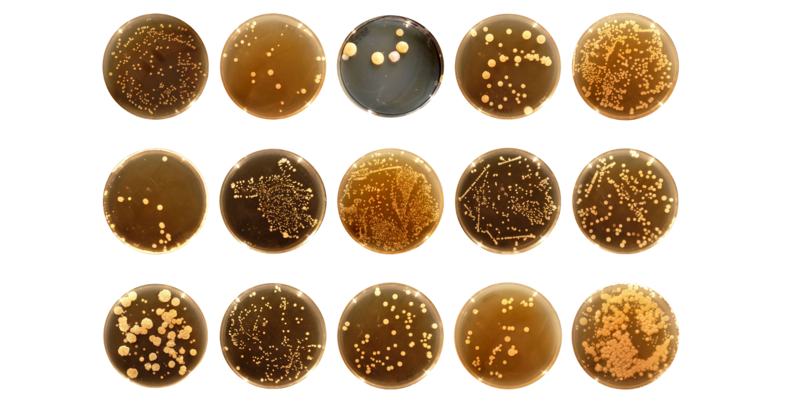
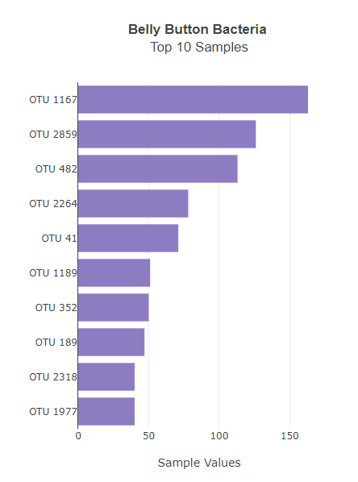
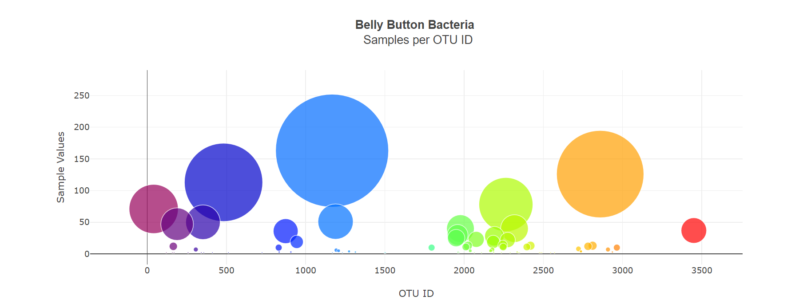
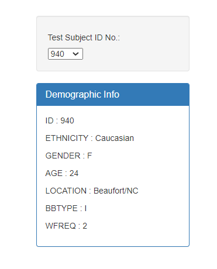
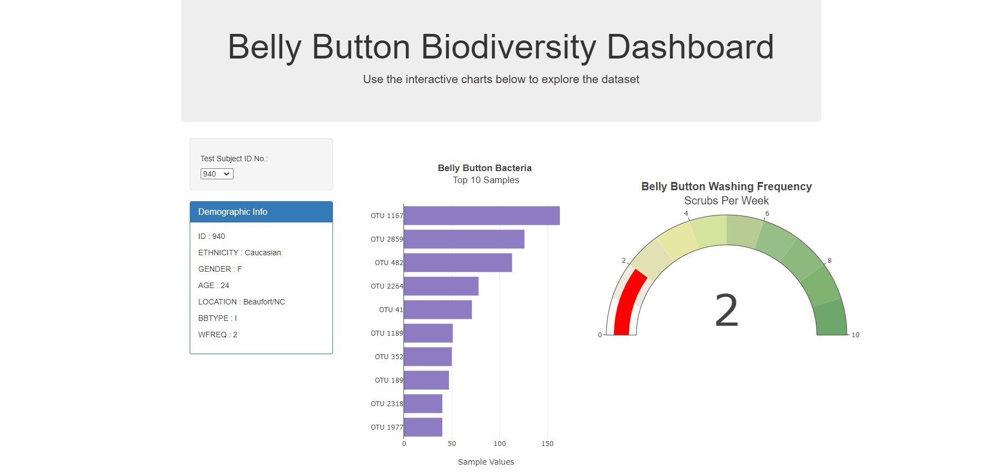
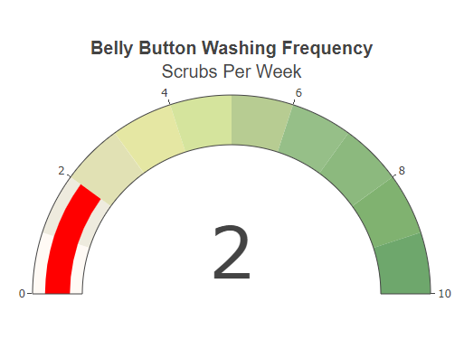

# Plotly Dashboard - Belly Button Biodiversity

Built an interactive dashboard to explore the [Belly Button Biodiversity dataset](http://robdunnlab.com/projects/belly-button-biodiversity/), which catalogs the microbes that colonize human navels.

The dataset reveals that a small handful of microbial species (also called operational taxonomic units, or OTUs, in the study) were present in more than 70% of people, while the rest were relatively rare.

## Horizontal Bar Chart

##### Created a horizontal bar chart with a dropdown menu to display the top 10 OTUs found in that individual.

- Used the D3 library to read in `samples.json`.

* Used `sample_values` as the values for the bar chart.

* Used `otu_ids` as the labels for the bar chart.

* Used `otu_labels` as the hovertext for the chart.

  

## Bubble Chart

##### Created a bubble chart that displays each sample.

* Used `otu_ids` for the x values.

* Used `sample_values` for the y values.

* Used `sample_values` for the marker size.

* Used `otu_ids` for the marker colors.

* Used `otu_labels` for the text values.

## Demographic Card Display

##### Created a Demographic Info Card to display the sample metadata, i.e., an individual's demographic information.

- #### All plots get updated any time that a new sample is selected.

## Gauge Chart

* ##### Gauge gets updated whenever a new sample is selected.

- - -

### Copyright

Fereshteh Aghaei © 2021. All Rights Reserved.